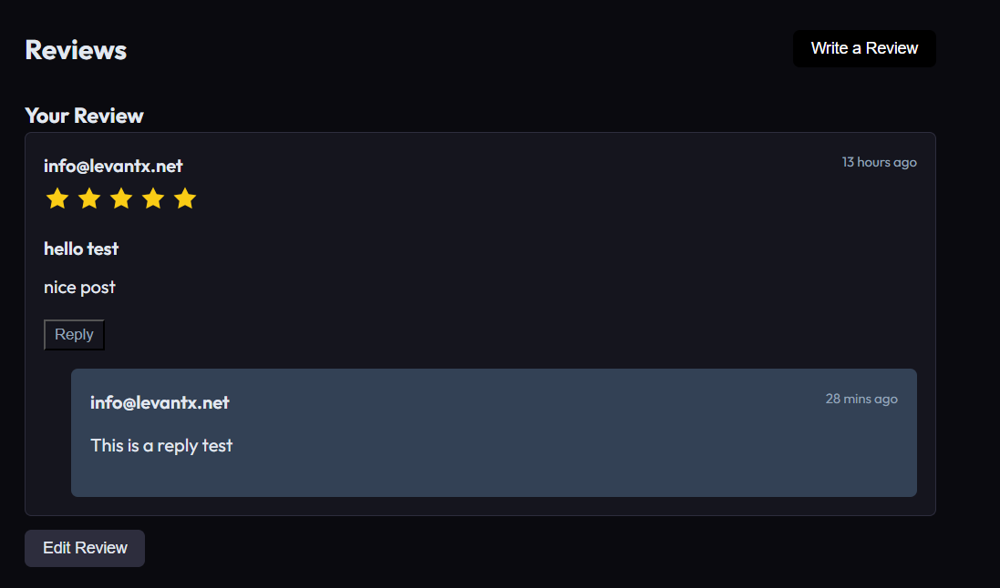

# Payload LFRs Plugin

A comprehensive plugin for [Payload CMS 3.x](https://payloadcms.com) that adds **Likes**, **Favourites**, **Ratings**, and **Reviews** (LFRs) capabilities to your existing collections.

## Features

- **Likes & Dislikes**: Allow users to like or dislike documents. Dislikes are mutually exclusive with likes.
- **Favourites**: Enable users to save documents to their favourites.
- **Ratings**: Add customizable rating systems (e.g., 5-star, 10-point scale, half-stars).
- **Reviews & Replies**: Let users write reviews and others to reply to them.
- **Review Media**: Users can attach images or videos to their reviews
- **Admin Moderation**: Moderation view to approve or delete reviews and replies
- **Extensible API**: Headless REST API for full frontend flexibility

## Screenshots

Here are examples of what you can build on the frontend using this plugin:

### Interactions (Likes, Dislikes, Favourites)


### Ratings Distribution & Submission


### Reviews & Threaded Replies



## Installation

```bash
npm install payload-lfrs
# or
pnpm add payload-lfrs
# or
yarn add payload-lfrs
```

## Example Project

This repository includes a fully functioning Next.js example project located in the `dev` folder. It demonstrates how to integrate the plugin into a Payload configuration and how to use the provided React components in a frontend application.

To run the example project locally:

```bash
git clone https://github.com/Talaween/Payload-LFRs.git
cd Payload-LFRs
pnpm install
pnpm dev
```

The example application will be available at `http://localhost:3000`.

## Basic Usage

Add the plugin to your Payload configuration. Below is a comprehensive example showcasing all available configuration options:

```typescript
import { buildConfig } from 'payload'
import { payloadLFRs } from 'payload-lfrs'

export default buildConfig({
  // ... your existing config
  plugins: [
    payloadLFRs({
      collections: {
        // Target collection slug
        posts: {
          likes: true,                 // Enable likes for authenticated users
          dislikes: true,              // Enable dislikes (mutually exclusive with likes)
          favourites: true,            // Enable favourites
          ratings: true,               // Enable ratings
          reviews: true,               // Enable reviews
          replies: ['admin'],          // Enable replies, but restrict to admin roles
          readReviews: 'public',       // Access control for reading reviews ('public', true, or roles array)
          allowMultipleReviews: false, // Prevent users from submitting multiple reviews on the same doc
          enableReviewRating: true,    // Force users to choose a rating score when reviewing
        },
      },
      // Configure global rating options
      rating: {
        max: 5,        // Max rating scale value (default: 5)
        step: 0.5,     // Value increment steps (default: 1)
        icon: 'star',  // Icon identifier hint for frontend (default: 'star')
      },
      // Enable review media uploads (requires an existing upload-enabled collection)
      reviewMedia: {
        uploadCollection: 'media',
        allowedMimeTypes: ['image/*'],
        maxFiles: 5,
        maxFileSize: 5 * 1024 * 1024, // 5MB
      },
      reviewModeration: true,  // Require reviews to be approved before they are public (default: false)
      adminControls: true,     // Set to false to hide the Global Settings from the Admin UI
      adminGroup: 'LFRs',      // Navigation group name in the Admin panel (default: 'LFRs')
      usersCollectionSlug: 'users', // Slug of your auth collection (default: 'users')
    }),
  ],
})
```

## Configuration

The `payloadLFRs` plugin accepts a configuration object with the following properties:

### `collections` (Required)

A map of collection slugs to enable LFRs features on. For each collection, you can enable specific features and configure access control.

```typescript
collections: {
  posts: {
    likes: true, // Enable likes for any authenticated user
    dislikes: false, // Disabled
    favourites: ['admin', 'subscriber'], // Only specific roles can favourite
    ratings: true,
    reviews: true,
    readReviews: 'public', // Set who can read reviews
    allowMultipleReviews: true, // Allow users to leave multiple reviews (default: false)
    enableReviewRating: false, // Make review ratings optional for comment-style reviews (default: true)
    replies: ['admin'], // Enable replies, but only admins can respond
  }
}
```

### `readReviews`

Access control for viewing reviews and replies.
Unlike the interaction features which default to `true` (requiring authentication), this defaults to `'public'`, allowing anyone (including guests) to read reviews and replies. You can restrict this to specific roles (e.g. `['admin']`), to logged-in users only (`true`), or provide a custom function.
_(Default: `'public'`)_

### `allowMultipleReviews`

If `true`, users can submit more than one review on the same document. If `false`, they are restricted to a single review, and the UI component will present an "Edit Review" button instead of "Write a Review".
_(Default: `false`)_

### `enableReviewRating`

If `false`, users can submit a review without being forced to provide a star rating. This effectively turns the review system into a standard comment system.
_(Default: `true`)_

#### Access Control

For each feature (`likes`, `dislikes`, `favourites`, `ratings`, `reviews`, `replies`), you can provide:

- `true`: Any authenticated user can use the feature (default if the feature key is omitted but the feature is mentioned, depending on implementation/type defaults).
- `false`: Feature disabled for this collection.
- `string[]`: Only users whose `roles` array includes at least one of these roles can use the feature. For example, `replies: ['admin']` restricts replying to administrators.
- `Function`: A custom async function receiving the request and target document. Return `true` to allow, `false` to deny.

```typescript
likes: async ({ req, targetCollection, targetDoc }) => {
  // Custom logic: e.g., only users who purchased this product can review it
  return true
}
```

### `rating`

Configure the rating system (default: 5-star, whole numbers).

```typescript
rating: {
  max: 5,        // Maximum rating value (default: 5)
  step: 0.5,     // Step increment, e.g., 0.5 for half-stars (default: 1)
  icon: 'star',  // Icon identifier hint for frontend (default: 'star')
}
```

### `reviewMedia`

Allow users to attach media to their reviews. **Note:** You must provide the slug of an existing upload-enabled collection.

```typescript
reviewMedia: {
  uploadCollection: 'media', // REQUIRED: an existing upload collection in your payload config
  allowedMimeTypes: ['image/jpeg', 'image/png'], // default: ['image/*']
  maxFiles: 3, // default: 5
  maxFileSize: 5 * 1024 * 1024, // 5MB limit
}
```

### `reviewModeration`

Set to `true` to require reviews to be approved before they are publicly visible (default: `false`). This also adds a dedicated Review Moderation view in the Admin panel.

```typescript
reviewModeration: true
```

### `usersCollectionSlug`

The slug of your users collection for authentication (default: `'users'`).

### `adminGroup`

The group name under which the LFRs collections will appear in the Admin UI (default: `'LFRs'`).

### `adminControls`

Set to `false` to hide the dynamic Global Settings page (`LFRs Settings`) from the Payload Admin panel (default: `true`). This prevents administrators from dynamically overriding the plugin's configuration at runtime, while keeping interaction collections accessible.

### `disabled`

Set to `true` to completely disable the plugin's features without uninstalling it or losing data (default: `false`).
When `disabled: true`, the plugin will continue to register its collections and fields to keep your database schema consistent (which is important for migrations), but it will _not_ register any API endpoints, lifecycle hooks, or Admin UI components. This is perfect for temporarily pausing interactions while keeping historical data intact.

### `collectionSlugs`

Override the default slugs for the internal collections created by the plugin (`likes`, `dislikes`, `favourites`, `ratings`, `reviews`, `replies`).

### Admin UI Runtime Controls (`LfrsSettings`)

The plugin automatically generates a **Payload Global** named `LFRs Settings` in the admin panel. This allows administrators to temporarily enable/disable features on the fly without changing code or restarting the server.

**Important:** The admin controls are strictly generated based on the developer's static config (`payload.config.ts`).

- An admin **cannot** turn on a feature (like `Reviews`) if the developer explicitly set it to `false` in the code.
- Admin overrides (e.g., turning off Moderation or disabling Likes during a spam attack) are instantly synced with the frontend UI and the REST API securely blocks all associated mutations.

### `callbacks`

Hook into user interactions and moderation state changes to trigger custom business logic (e.g., sending email notifications, awarding points, syncing with external systems). All callbacks can be asynchronous.

```typescript
plugins: [
  payloadLFRs({
    // ...
    callbacks: {
      onReviewSubmitted: async ({ req, review }) => {
        // Triggered when a user creates or edits a review
        console.log(`Review submitted by user ${req.user.id}`)
      },
      onReviewStateChanged: async ({ req, review, previousStatus }) => {
        // Triggered when an admin changes a review's moderation status
        if (review.status === 'approved' && previousStatus !== 'approved') {
          // Send a notification email to the author
        }
      },
      onLiked: async ({ req, like }) => {
        // Example: Award points to the target document's author
      },
    },
  }),
]
```

**Available Callbacks (all receive the `PayloadRequest` object along with relevant context):**

- **`onReviewSubmitted`**: `{ req, review }` — Triggered when a user creates or updates a review.
- **`onReviewDeleted`**: `{ req, reviewId, targetCollection, targetDoc }` — Triggered when a user deletes their review.
- **`onReplySubmitted`**: `{ req, reply }` — Triggered when a user creates or updates a reply.
- **`onReviewStateChanged`**: `{ req, review, previousStatus }` — Triggered when an admin changes a review's `status` via the Admin panel.
- **`onRatingSubmitted`**: `{ req, rating }` — Triggered when a user submits a net-new standalone rating.
- **`onRatingUpdated`**: `{ req, rating }` — Triggered when a user updates their existing rating.
- **`onLiked`**: `{ req, like }` — Triggered when a user likes a document.
- **`onUnliked`**: `{ req, targetCollection, targetDoc }` — Triggered when a user removes their like.
- **`onDisliked`**: `{ req, dislike }` — Triggered when a user dislikes a document.
- **`onUndisliked`**: `{ req, targetCollection, targetDoc }` — Triggered when a user removes their dislike.

## How It Works

1. **Collections Added**: The plugin automatically creates collections to store interactions (e.g. `lfrs_likes`, `lfrs_reviews`).
2. **Fields Injected**: It injects an `lfrs` field group into your target collections, containing aggregate data (e.g., `lfrs.likesCount`, `lfrs.averageRating`).
3. **Endpoints Created**: It registers REST endpoints under `/api/lfrs/...` to handle interactions (e.g., `/api/lfrs/like`, `/api/lfrs/rate`).
4. **Admin UI**: Adds custom components and moderation views to the Payload Admin panel.

### Interactions Status Widget

For each target collection where LFRs features are enabled, the plugin injects a custom **Interactions Status Widget** into the document's edit view sidebar. This widget displays an at-a-glance summary of all aggregated interactions for that document (such as total likes, total reviews, and average rating).

### Review Moderation View

If `reviewModeration: true` is enabled in your configuration, the plugin provides a dedicated **Review Moderation Queue** view in the Admin panel. Accessible via `/admin/lfrs-moderation`, this dashboard allows administrators to efficiently review, approve, or reject pending user reviews and replies before they are publicly displayed.

## API Endpoints

The plugin exposes several endpoints for interacting with the LFRs features from your frontend:

- `POST /api/lfrs/like` — Toggles a user's like on a document.
  - **Body:** `{ collection: string, id: string }`
  - **Returns:** `{ liked: boolean, likesCount: number, disliked?: boolean, dislikesCount?: number }`
- `POST /api/lfrs/dislike` — Toggles a user's dislike on a document.
  - **Body:** `{ collection: string, id: string }`
  - **Returns:** `{ disliked: boolean, dislikesCount: number, liked?: boolean, likesCount?: number }`
- `POST /api/lfrs/favourite` — Toggles a user's favorite on a document.
  - **Body:** `{ collection: string, id: string }`
  - **Returns:** `{ favourited: boolean, favouritesCount: number }`
- `POST /api/lfrs/rate` — Submits or updates a user rating score.
  - **Body:** `{ collection: string, id: string, score: number }`
  - **Returns:** `{ rating: object, ratingConfig: object, ratingsAverage: number, ratingsCount: number }`
- `POST /api/lfrs/review` — Submits or updates a user review.
  - **Body:** `{ collection: string, id: string, body: string, title?: string, score?: number, media?: string[], reviewId?: string }`
  - **Returns:** `{ review: object, reviewsCount: number }`
- `DELETE /api/lfrs/review` — Deletes a user's review.
  - **Body:** `{ reviewId: string }`
  - **Returns:** `{ deleted: true, reviewsCount: number }`
- `POST /api/lfrs/reply` — Submits or updates a reply to a review.
  - **Body:** `{ body: string, reviewId: string, replyId?: string }`
  - **Returns:** `{ reply: object, repliesCount: number }`
- `DELETE /api/lfrs/reply` — Deletes a reply.
  - **Body:** `{ replyId: string }`
  - **Returns:** `{ deleted: true, repliesCount: number }`
- `GET /api/lfrs/status` — Returns feature configuration flags and the current user's interaction states.
  - **Query:** `collection` (required), `id` (required)
  - **Returns:** `{ likesCount: number, dislikesCount: number, liked: boolean, favourited: boolean, rating: number | null, review: object | null, ... }`
- `GET /api/lfrs/interactions` — Fetches paginated lists of ratings or reviews.
  - **Query:** `collection` (required), `id` (required), `type` (optional: `'reviews'` | `'ratings'`, default: `'reviews'`), `page` (optional), `limit` (optional), `sort` (optional: `'newest'` | `'oldest'` | `'highest'` | `'lowest'`)
  - **Returns:** `{ docs: Array, page: number, totalDocs: number, totalPages: number }`
- `GET /api/lfrs/distribution` — Returns rating score distribution frequencies.
  - **Query:** `collection` (required), `id` (required)
  - **Returns:** `{ averageScore: number, totalRatings: number, distribution: Array<{ score: number, count: number, percentage: number }> }`
- `GET /api/lfrs/user-favourites` — Returns document IDs favorited by a user.
  - **Query:** `collection` (required), `userId` (required), `limit` (optional)
  - **Returns:** `{ ids: string[] }`
- `GET /api/lfrs/user-reviews` — Gets a specific user's reviews for a document.
  - **Query:** `collection` (required), `id` (required), `userId` (required)
  - **Returns:** `{ reviews: Array }`
- `GET /api/lfrs/likes-count` — Gets the total likes count.
  - **Query:** `collection` (required), `id` (required)
  - **Returns:** `{ likesCount: number }`
- `GET /api/lfrs/dislikes-count` — Gets the total dislikes count.
  - **Query:** `collection` (required), `id` (required)
  - **Returns:** `{ dislikesCount: number }`
- `GET /api/lfrs/likes-users` — Gets user IDs who liked a document.
  - **Query:** `collection` (required), `id` (required), `limit` (optional)
  - **Returns:** `{ userIds: string[] }`
- `GET /api/lfrs/dislikes-users` — Gets user IDs who disliked a document.
  - **Query:** `collection` (required), `id` (required), `limit` (optional)
  - **Returns:** `{ userIds: string[] }`

- **Authentication (with user context) is required for all `POST` and `DELETE` endpoints.**

## Frontend UI Components

The plugin provides a suite of ready-to-use React components for your frontend application. These components are exported via `payload-lfrs/client` and are built as client components (`"use client"`) to handle user interactions and optimistic UI updates seamlessly.

### Available Components

- **`LfrsLikeDislike`**: A toggleable thumbs-up/thumbs-down widget displaying current counts.
- **`LfrsFavourite`**: A bookmark/favorite button for saving documents.
- **`LfrsRating`**: An interactive star rating component for users to submit a score.
- **`LfrsRatingSummary`**: A visual summary showing the average rating and score distribution.
- **`LfrsComposeReview` / `LfrsComposeReply`**: Forms for submitting text reviews and nested replies.
- **`LfrsReviewCard` / `LfrsReplyCard`**: Display components for rendering individual reviews and replies.
- **`LfrsReviewsSection`**: A complete, integrated reviews area combining the summary, compose form, and a list of reviews.

### Example Usage

```tsx
import { LfrsLikeDislike, LfrsRating } from 'payload-lfrs/client'

export function PostDetails({ post }) {
  return (
    <div>
      <h1>{post.title}</h1>

      {/* Like / Dislike Toggle */}
      <LfrsLikeDislike
        targetCollection="posts"
        targetDoc={post.id}
        initialLikesCount={post.lfrs?.likesCount || 0}
        initialLiked={false} // Optionally pass initial state from server
      />

      {/* 5-Star Rating */}
      <LfrsRating targetCollection="posts" targetDoc={post.id} maxRating={5} />
    </div>
  )
}
```

### UI Customization (CSS Variables)

The UI components are built to seamlessly integrate with your existing site. They use **CSS Variables** which can be overridden globally in your app (e.g. in your `:root` or `body` block), or scoped directly to the components using the `style` prop!

Here are the available variables and their default fallback values:

```css
:root {
  --lfrs-primary: #000000; /* Used for primary buttons (e.g. "Write a Review") */
  --lfrs-text: #333333; /* Main text color */
  --lfrs-text-muted: #666666; /* Dates, secondary text, placeholders */
  --lfrs-bg: #ffffff; /* Main background color for cards */
  --lfrs-bg-muted: #f5f5f5; /* Background for replies and forms */
  --lfrs-border: #e0e0e0; /* Borders around cards and inputs */

  --lfrs-star-active: #ffb400; /* Color of filled rating stars and bars */
  --lfrs-star-inactive: #e0e0e0; /* Color of empty rating stars */

  --lfrs-like-active: #0066cc; /* Active state for Like button */
  --lfrs-dislike-active: #cc0000; /* Active state for Dislike button */
  --lfrs-favourite-active: #ff0055; /* Active state for Favourite button */

  --lfrs-radius: 6px; /* Border radius for buttons, inputs, and cards */
  --lfrs-font: inherit; /* Font family inherited from your app by default */
}
```

#### Example: Inline Scoped Customization

If you want to style a single component, you can pass the variables via the `style` prop:

```tsx
<LfrsRatingSummary
  targetCollection="posts"
  targetDoc={post.id}
  style={
    {
      '--lfrs-star-active': '#10b981', // Green stars
      '--lfrs-bg': '#1f2937', // Dark mode background
      '--lfrs-text': '#f9fafb', // Light text
    } as React.CSSProperties
  }
/>
```

## Building Custom UIs (Headless Usage)

The plugin is designed to be completely framework-agnostic. While we provide React components for convenience, you can build your own custom user interfaces in any framework (Vue, Svelte, Angular, React Native, or vanilla JavaScript) by directly interacting with the plugin's REST API.

### Custom Component Example

Here is an example of how you might build a custom "Like" interaction in vanilla JavaScript:

```javascript
async function toggleLike(targetCollection, targetDocId) {
  try {
    const response = await fetch('/api/lfrs/like', {
      method: 'POST',
      headers: {
        'Content-Type': 'application/json',
        // 'Authorization': 'Bearer YOUR_TOKEN' // If required
      },
      body: JSON.stringify({
        collection: targetCollection,
        id: targetDocId,
      }),
    })

    if (!response.ok) throw new Error('Failed to toggle like')

    const data = await response.json()

    // Update your custom UI state here...
  } catch (error) {
    console.error(error)
  }
}
```

You can similarly use the `GET /api/lfrs/status` endpoint to fetch the current user's interaction state when a page loads, and map other interactions (Favorites, Ratings, Reviews) to their respective endpoints.

## Architecture & Developer Guide

If you are reviewing, contributing to, or debugging the plugin, here's an overview of the codebase structure and internal architecture.

### Code Organization

- `src/plugin.ts`: The main entry point. It accepts user configuration, sanitizes it (applying defaults), and injects the collections, fields, and endpoints into the Payload config.
- `src/collections/`: Contains the definitions for the plugin-managed collections (`likes`, `dislikes`, `favourites`, `ratings`, `reviews`, `replies`). These store the actual user interactions.
- `src/fields/`:
  - `aggregateFields.ts`: Generates the `lfrs` field group (e.g., `lfrs.likesCount`, `lfrs.averageRating`) that gets injected into target collections.
  - `joinFields.ts`: Injects Payload Join fields so administrators can see related LFRs documents directly from the target document's admin UI.
- `src/endpoints/`: The REST API implementations. These handle incoming user requests, enforce access control, and perform the database operations.
- `src/hooks/`: Contains Payload lifecycle hooks. E.g., `cascadeDelete.ts` ensures that when a target document is deleted, all associated interactions are also removed to prevent orphaned records.
- `src/admin/`: React components for Payload's Admin panel. Includes status widgets and the Review Moderation view.
- `src/types.ts`: TypeScript interfaces and types for configuration, internal sanitized config, and feature access.

### Aggregate Count Logic (Endpoint-Driven)

To ensure high reliability and avoid transaction context poisoning within Payload CMS, the aggregation logic (e.g., updating a post's `likesCount` or `dislikesCount`) is primarily **Endpoint-Driven**:

1. **Endpoints Suppress Hooks**: When a user interacts via the API endpoints (e.g., `/api/lfrs/like`), the endpoints perform the necessary database mutations (`create`, `delete`) while passing `context: { skipLfrsHooks: true }`. This suppresses the automatic hook-based recalculation.
2. **Explicit Updates**: After all mutations complete successfully, the endpoint explicitly counts the interactions directly from the database (serving as the source of truth) and performs a single atomic update to the target document's aggregate fields.
3. **Admin Panel Fallback**: The `afterChange` and `afterDelete` hooks in `src/hooks/recalculateAggregates.ts` are still kept as fallbacks. They will automatically recalculate the counts if an administrator creates or deletes an interaction manually from the Payload Admin UI, maintaining data consistency.

## License

MIT
