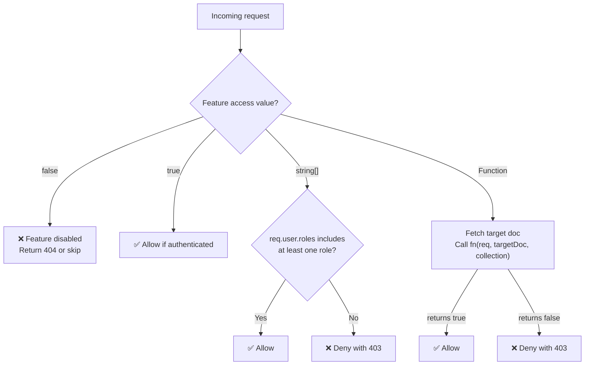
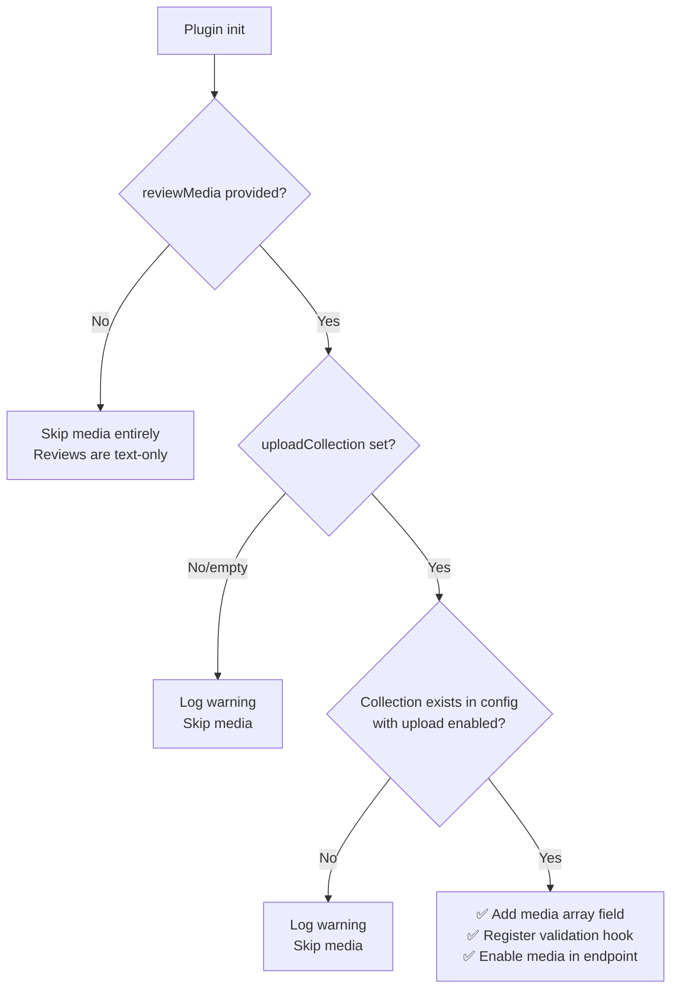

# LFRs Plugin — Implementation Plan

> **Like · Favourite · Rate · Review** for Payload CMS 3.x

---

## 1. Overview

The **payload-lfrs** plugin lets any Payload CMS collection receive social interactions from authenticated users:

| Feature       | Description                                                                                            |
| ------------- | ------------------------------------------------------------------------------------------------------ |
| **Like**      | Toggle like/unlike on a document (one per user per doc)                                                |
| **Dislike**   | Toggle dislike/un-dislike on a document (optional, one per user per doc, mutually exclusive with like) |
| **Favourite** | Toggle favourite/unfavourite on a document (one per user per doc)                                      |
| **Rate**      | Submit a numeric rating (1–5 stars, one per user per doc, can update)                                  |
| **Review**    | Submit a text review with optional media and a rating (one per user per doc, can update)               |
| **Reply**     | Reply to a review (one level deep, by any user or admin)                                               |

Each feature is **opt-in** per collection via the plugin config, so consumers can enable only what they need.

The plugin also provides **ready-to-use React UI components** that developers can import and render on their frontend, alongside full REST API and Local API access for custom implementations.

---

## 2. Data Modelling Strategy

### Why Separate Collections (Not Embedded Fields)?

We store interactions in **dedicated plugin-managed collections** rather than embedding them as array/group fields on the target document. Reasons:

| Concern         | Embedded fields                                   | Separate collections ✅                                       |
| --------------- | ------------------------------------------------- | ------------------------------------------------------------- |
| Scalability     | Document grows unboundedly with every interaction | Interactions are independent documents; target doc stays lean |
| Querying        | Hard to paginate/filter "all reviews for doc X"   | Native `find()` with `where` on `targetDoc`                   |
| Access control  | Mixed with target doc permissions                 | Independent access control per interaction type               |
| Aggregation     | Must compute in hooks on every read               | Cached aggregates on target doc via `afterChange` hooks       |
| User uniqueness | Complex array validation                          | Simple `unique` compound index equivalent via hooks           |
| Admin UI        | Clutters the target doc form                      | Clean join fields or sidebar widgets                          |

### Aggregate Caching on Target Documents

To avoid expensive queries on every read, we inject **virtual aggregate fields** into the target collections via `afterRead` hooks or store **cached aggregate fields** that are updated via `afterChange`/`afterDelete` hooks on the interaction collections. We use the **cached aggregate approach** for performance:

**Injected fields on target collection** (via plugin field injection):

```
lfrs_likesCount       : number (default: 0)
lfrs_dislikesCount    : number (default: 0)   // only if dislikes enabled
lfrs_favouritesCount  : number (default: 0)
lfrs_ratingsCount     : number (default: 0)
lfrs_ratingsAverage   : number (default: 0)
lfrs_reviewsCount     : number (default: 0)
```

These are real persisted fields that get updated by hooks whenever an interaction is created/updated/deleted.

---

## 3. Plugin Configuration Type

```ts
import type { CollectionSlug } from 'payload'

export interface LfrsPluginConfig {
  /**
   * Enable the plugin (default: true).
   * When false, collections/fields are still added for DB schema consistency,
   * but endpoints, hooks, and UI components are not registered.
   */
  disabled?: boolean

  /**
   * Map of collections to enable LFRs features on.
   * Each collection can enable a subset of features.
   */
  collections: Partial<Record<CollectionSlug, LfrsCollectionOptions>>

  /**
   * The slug of the users collection for auth (default: 'users')
   */
  usersCollectionSlug?: string

  /**
   * Rating system configuration.
   * Controls max value, step increments (half-stars), and icon hints.
   * See LfrsRatingConfig for details.
   *
   * Default: 5-star, whole numbers only, star icon.
   */
  rating?: LfrsRatingConfig

  /**
   * Whether reviews require moderation before being visible (default: false)
   */
  reviewModeration?: boolean

  /**
   * Review media configuration.
   * Allows users to attach images/videos to their reviews.
   *
   * If omitted or if `uploadCollection` is not provided, the plugin works
   * normally but the media array field is NOT added to the reviews collection
   * and file uploads are silently skipped.
   */
  reviewMedia?: LfrsReviewMediaConfig

  /**
   * Override slugs for plugin-created collections
   */
  collectionSlugs?: {
    likes?: string
    favourites?: string
    ratings?: string
    reviews?: string
  }

  /**
   * Admin UI group name (default: 'LFRs')
   */
  adminGroup?: string
}

export interface LfrsReviewMediaConfig {
  /**
   * REQUIRED — slug of an existing upload-enabled collection that will
   * host the review media files (e.g. 'media', 'review-uploads').
   *
   * The collection MUST already exist in the Payload config with
   * `upload: true` (or upload config object). The plugin does NOT
   * create this collection; it only references it.
   *
   * If this field is missing or the referenced collection is not found
   * at build time, media uploads are silently disabled and the plugin
   * logs a warning.
   */
  uploadCollection: string

  /**
   * Maximum number of files per review (default: 5).
   * Translates to the `maxRows` option on the array field.
   */
  maxFiles?: number

  /**
   * Allowed MIME types as glob patterns.
   * Examples: ['image/*'], ['image/jpeg', 'image/png', 'video/mp4']
   *
   * Default: ['image/*'] (images only).
   *
   * Validated in a `beforeChange` hook on the reviews collection.
   * Files with disallowed types are rejected with a 400 error.
   */
  allowedMimeTypes?: string[]

  /**
   * Maximum file size in bytes per individual file.
   * Example: 5 * 1024 * 1024 (5 MB)
   *
   * Default: 5242880 (5 MB).
   *
   * Validated in a `beforeChange` hook on the reviews collection.
   * Files exceeding this size are rejected with a 400 error.
   */
  maxFileSize?: number
}

export interface LfrsRatingConfig {
  /**
   * Maximum rating value (default: 5).
   * The minimum is always 1 (a rating of 0 = no rating, handled by deletion).
   *
   * Examples: 5 for 5-star, 10 for 10-point scale.
   */
  max?: number

  /**
   * Step increment for valid rating values (default: 1).
   *
   * - `1`   → whole numbers only: 1, 2, 3, 4, 5
   * - `0.5` → half values allowed: 0.5, 1, 1.5, 2, ... 5
   * - `0.1` → fine-grained: 0.1, 0.2, ... 5.0
   *
   * Validation: score must be a multiple of `step` and within [step, max].
   * (The minimum valid score is `step`, not 0 — a rating of 0 doesn't make
   * sense; to "un-rate" a document the user deletes the rating.)
   */
  step?: number

  /**
   * Icon identifier hint for frontend rendering (default: 'star').
   *
   * This is a string label stored in the sanitized config and returned
   * in the `/api/lfrs/status` endpoint response metadata. It does NOT
   * affect backend logic — it's purely a hint so the frontend knows
   * which icon set to render (stars, hearts, thumbs, flames, etc.).
   *
   * Examples: 'star', 'heart', 'thumb', 'flame'
   */
  icon?: string
}

/**
 * Access control for a single LFRs feature on a specific collection.
 *
 * - `true`     → any authenticated user can perform this action (default)
 * - `false`    → feature disabled for this collection
 * - `string[]` → only users whose `roles` array includes at least one of these roles
 * - `Function` → custom async check receiving the request and target document
 */
export type LfrsFeatureAccess = boolean | string[] | LfrsFeatureAccessFn

/**
 * Custom access function for dynamic per-document checks.
 *
 * Receives the Payload request (with `req.user`) and the target document
 * being interacted with. Return `true` to allow, `false` to deny.
 *
 * Use this for business logic like:
 * - "Only users who purchased this product can review it"
 * - "Only enrolled students can rate a course"
 * - "Only users in the same organisation can favourite a resource"
 */
export type LfrsFeatureAccessFn = (args: {
  /** The Payload request with authenticated user */
  req: PayloadRequest
  /** The target document being liked/favourited/rated/reviewed */
  targetDoc: Record<string, any>
  /** The slug of the target collection */
  targetCollection: string
}) => boolean | Promise<boolean>

export interface LfrsCollectionOptions {
  /**
   * Enable/control likes.
   * Default: true (any authenticated user)
   */
  likes?: LfrsFeatureAccess
  /**
   * Enable/control dislikes.
   * Default: false (disabled).
   * When enabled, dislikes are mutually exclusive with likes — liking
   * removes an existing dislike and vice versa.
   */
  dislikes?: LfrsFeatureAccess
  /**
   * Enable/control favourites.
   * Default: true (any authenticated user)
   */
  favourites?: LfrsFeatureAccess
  /**
   * Enable/control ratings.
   * Default: true (any authenticated user)
   */
  ratings?: LfrsFeatureAccess
  /**
   * Enable/control reviews.
   * Default: true (any authenticated user)
   */
  reviews?: LfrsFeatureAccess
  /**
   * Enable/control replies on reviews.
   * Default: true (any authenticated user can reply).
   * Replies are one level deep — no nested threads.
   */
  replies?: LfrsFeatureAccess
}
```

### Usage Examples

**With media uploads enabled:**

```ts
import { payloadLfRs } from 'payload-lfrs'

export default buildConfig({
  collections: [
    {
      slug: 'review-media',
      upload: {
        staticDir: path.resolve(dirname, 'review-media'),
        mimeTypes: ['image/jpeg', 'image/png', 'image/webp', 'video/mp4'],
      },
      fields: [],
    },
    // ... other collections
  ],
  plugins: [
    payloadLfRs({
      collections: {
        posts: { likes: true, favourites: true, ratings: true, reviews: true },
        products: { likes: true, ratings: true, reviews: true },
      },
      reviewMedia: {
        uploadCollection: 'review-media',
        maxFiles: 3,
        allowedMimeTypes: ['image/jpeg', 'image/png', 'image/webp', 'video/mp4'],
        maxFileSize: 10 * 1024 * 1024, // 10 MB
      },
      reviewModeration: true,
      // Default rating: 5 stars, whole numbers, star icon
    }),
  ],
})
```

**With custom rating system (half-star hearts out of 10):**

```ts
payloadLfRs({
  collections: {
    restaurants: { ratings: true, reviews: true },
  },
  rating: {
    max: 10,
    step: 0.5,
    icon: 'heart',
  },
})
```

**With role-based access:**

```ts
payloadLfRs({
  collections: {
    posts: {
      likes: true, // any authenticated user
      favourites: true, // any authenticated user
      ratings: ['subscriber', 'admin'], // only subscribers and admins
      reviews: ['subscriber', 'admin'], // only subscribers and admins
    },
    'internal-docs': {
      likes: ['employee', 'admin'], // only employees
      favourites: ['employee', 'admin'],
      ratings: false, // disabled entirely
      reviews: false, // disabled entirely
    },
  },
})
```

**With custom access function (e.g. purchased products only):**

```ts
payloadLfRs({
  collections: {
    products: {
      likes: true,
      favourites: true,
      ratings: async ({ req, targetDoc }) => {
        // Only allow rating if user has purchased this product
        const { totalDocs } = await req.payload.count({
          collection: 'orders',
          where: {
            and: [
              { customer: { equals: req.user.id } },
              { 'items.product': { equals: targetDoc.id } },
              { status: { equals: 'completed' } },
            ],
          },
        })
        return totalDocs > 0
      },
      reviews: async ({ req, targetDoc }) => {
        // Same check for reviews — only purchasers can review
        const { totalDocs } = await req.payload.count({
          collection: 'orders',
          where: {
            and: [
              { customer: { equals: req.user.id } },
              { 'items.product': { equals: targetDoc.id } },
              { status: { equals: 'completed' } },
            ],
          },
        })
        return totalDocs > 0
      },
    },
  },
})
```

**Without media uploads (text-only reviews):**

```ts
payloadLfRs({
  collections: {
    recipes: { likes: true, favourites: true, reviews: true },
  },
  // reviewMedia omitted → reviews work fine, just no file attachments
})
```

**With incomplete media config (graceful fallback):**

```ts
payloadLfRs({
  collections: { posts: { reviews: true } },
  reviewMedia: {
    uploadCollection: 'non-existent-collection', // ← not in config
    maxFiles: 5,
  },
  // Plugin logs a warning and disables media silently
})
```

---

## 4. Plugin-Created Collections

### 4.1 `lfrs-likes`

| Field              | Type                   | Description                                    |
| ------------------ | ---------------------- | ---------------------------------------------- |
| `user`             | `relationship` → users | The user who liked                             |
| `targetCollection` | `text`                 | Slug of the target collection (e.g. `'posts'`) |
| `targetDoc`        | `text`                 | ID of the liked document                       |

**Compound uniqueness**: Enforced via `beforeChange` hook — one like per user per target doc.

**Indexes**: `targetCollection` + `targetDoc` (compound), `user`

### 4.2 `lfrs-dislikes`

Only created if **any** collection enables `dislikes`.

| Field              | Type                   | Description                   |
| ------------------ | ---------------------- | ----------------------------- |
| `user`             | `relationship` → users | The user who disliked         |
| `targetCollection` | `text`                 | Slug of the target collection |
| `targetDoc`        | `text`                 | ID of the disliked document   |

**Compound uniqueness**: One dislike per user per target doc.

**Mutual exclusivity**: When a user dislikes, any existing like by the same user on the same doc is automatically removed (and vice versa). This is handled in the endpoint handler, not in hooks.

### 4.3 `lfrs-favourites`

| Field              | Type                   | Description                   |
| ------------------ | ---------------------- | ----------------------------- |
| `user`             | `relationship` → users | The user who favourited       |
| `targetCollection` | `text`                 | Slug of the target collection |
| `targetDoc`        | `text`                 | ID of the favourited document |

Same uniqueness pattern as likes.

### 4.4 `lfrs-ratings`

| Field              | Type                   | Description                                                                                  |
| ------------------ | ---------------------- | -------------------------------------------------------------------------------------------- |
| `user`             | `relationship` → users | The user who rated                                                                           |
| `targetCollection` | `text`                 | Slug of the target collection                                                                |
| `targetDoc`        | `text`                 | ID of the rated document                                                                     |
| `score`            | `number`               | Rating value. Validated: must be a multiple of `rating.step`, within [`step`, `rating.max`]. |

**Compound uniqueness**: One rating per user per target doc.

**Score validation example** (with default config `max: 5, step: 1`):

- ✅ `1`, `2`, `3`, `4`, `5`
- ❌ `0`, `0.5`, `2.5`, `6`, `-1`

**Score validation example** (with `max: 10, step: 0.5`):

- ✅ `0.5`, `1`, `1.5`, `2`, ... `9.5`, `10`
- ❌ `0`, `0.3`, `10.5`, `-1`

### 4.5 `lfrs-reviews`

| Field              | Type                                             | Condition                          | Description                                                             |
| ------------------ | ------------------------------------------------ | ---------------------------------- | ----------------------------------------------------------------------- |
| `user`             | `relationship` → users                           | Always                             | The reviewing user                                                      |
| `targetCollection` | `text`                                           | Always                             | Slug of the target collection                                           |
| `targetDoc`        | `text`                                           | Always                             | ID of the reviewed document                                             |
| `title`            | `text`                                           | Always                             | Review title (optional)                                                 |
| `body`             | `textarea`                                       | Always                             | Review body text                                                        |
| `score`            | `number`                                         | Always                             | Rating included with the review (same validation as standalone ratings) |
| `media`            | `array` → see below                              | Only if `reviewMedia` is valid     | Attached images/videos                                                  |
| `status`           | `select` (`pending` \| `approved` \| `rejected`) | Only if `reviewModeration` enabled | Moderation status                                                       |
| `repliesCount`     | `number`                                         | Always                             | Cached count of replies (default: 0)                                    |

**Compound uniqueness**: One review per user per target doc.

### 4.6 `lfrs-replies`

Only created if **any** collection enables `replies`.

| Field    | Type                                             | Description                        |
| -------- | ------------------------------------------------ | ---------------------------------- |
| `user`   | `relationship` → users                           | The user who replied               |
| `review` | `relationship` → lfrs-reviews                    | The parent review being replied to |
| `body`   | `textarea`                                       | Reply text                         |
| `status` | `select` (`pending` \| `approved` \| `rejected`) | Only if `reviewModeration` enabled |

**Threading model**: One level deep only — replies reference a review, not other replies. This keeps the UI clean and avoids deeply nested threads.

**No uniqueness constraint**: A user can post multiple replies to the same review (unlike likes/ratings which are one-per-user).

**Access**: Same access rules as the parent review's collection — the `replies` feature access on the target collection controls who can reply.

#### `media` Array Field (Conditional)

This field is **only added** to the reviews collection when **all** of these conditions are met during plugin initialization:

1. `reviewMedia` is provided in the plugin config
2. `reviewMedia.uploadCollection` is a non-empty string
3. The referenced upload collection **exists** in the Payload config's `collections` array **and** has `upload` enabled

If any condition fails, the plugin logs a warning and the `media` field is omitted entirely — reviews work as text-only.

When the field **is** added:

```ts
{
  name: 'media',
  type: 'array',
  maxRows: reviewMedia.maxFiles ?? 5,
  labels: { singular: 'File', plural: 'Files' },
  admin: { initCollapsed: true },
  fields: [
    {
      name: 'file',
      type: 'upload',
      relationTo: reviewMedia.uploadCollection, // e.g. 'review-media'
      required: true,
    },
  ],
}
```

#### Media Validation (via `beforeChange` hook)

Even though the upload collection may have its own mime/size constraints, the plugin adds a **`beforeChange` hook on `lfrs-reviews`** that re-validates each attached file against the plugin-level limits:

| Check      | Source                                                                        | Behaviour on failure                                          |
| ---------- | ----------------------------------------------------------------------------- | ------------------------------------------------------------- |
| File count | `media.length > maxFiles`                                                     | `APIError('Maximum of N files allowed', 400)`                 |
| MIME type  | Each `media[].file` doc's `mimeType` against `allowedMimeTypes` glob patterns | `APIError('File type X is not allowed', 400)`                 |
| File size  | Each `media[].file` doc's `filesize` against `maxFileSize`                    | `APIError('File X exceeds the maximum size of N bytes', 400)` |

This provides a **defence-in-depth** layer on top of the upload collection's own restrictions, and gives the plugin consumer fine-grained control without modifying their upload collection config.

---

## 5. Fields Injected into Target Collections

For each enabled target collection, the plugin injects:

```ts
// Always added (for DB schema consistency even when disabled)
{
  name: 'lfrs',
  type: 'group',
  admin: { position: 'sidebar', condition: () => true, readOnly: true },
  fields: [
    // Only the fields for enabled features:
    { name: 'likesCount', type: 'number', defaultValue: 0 },
    { name: 'dislikesCount', type: 'number', defaultValue: 0 },  // only if dislikes enabled
    { name: 'favouritesCount', type: 'number', defaultValue: 0 },
    { name: 'ratingsCount', type: 'number', defaultValue: 0 },
    { name: 'ratingsAverage', type: 'number', defaultValue: 0 },
    { name: 'reviewsCount', type: 'number', defaultValue: 0 },
  ],
}
```

Additionally, **join fields** are added so the admin panel can show related interactions:

```ts
{
  name: 'lfrs_likes',
  type: 'join',
  collection: 'lfrs-likes',
  on: 'targetDoc',
  // with appropriate where filter for targetCollection
}
```

---

## 6. Access Control

### Feature-Level Access (Per Collection, Per Feature)

Each feature on each collection has its own access gate, resolved at **endpoint/hook time** (not at Payload collection-level `access`). The resolution follows this priority:



| Access value          | Resolved at | Behaviour                                                                                                                           |
| --------------------- | ----------- | ----------------------------------------------------------------------------------------------------------------------------------- |
| `false`               | Build time  | Feature's fields are still added (DB schema consistency), but endpoints return `404` and the feature is hidden from status response |
| `true`                | Runtime     | Any authenticated user can perform the action                                                                                       |
| `string[]` (roles)    | Runtime     | `req.user.roles` is checked for intersection with the provided array. If no match → `403 Forbidden`                                 |
| `LfrsFeatureAccessFn` | Runtime     | The target document is fetched, then the function is called. If it returns `false` → `403 Forbidden`                                |

> [!NOTE]
> The role check assumes the user document has a `roles` field (array of strings). This is configurable via the `usersCollectionSlug` option and the plugin reads whatever `roles` field exists on that collection. If the users collection doesn't have a `roles` field and a string[] access is used, the check will always deny.

### Payload Collection-Level Access (on interaction collections)

These are the **Payload access control functions** set on the `lfrs-*` interaction collections themselves (separate from the feature access above):

| Operation | Rule                                                                                                                                                                                    |
| --------- | --------------------------------------------------------------------------------------------------------------------------------------------------------------------------------------- |
| `create`  | Authenticated users only. The `user` field is auto-set to `req.user.id` (cannot be spoofed). Feature-level access is checked in the endpoint handler before reaching collection create. |
| `read`    | Public read (anyone can see likes/reviews) or configurable.                                                                                                                             |
| `update`  | Own interactions only (ratings, reviews — likes/favourites are toggle-only via endpoint).                                                                                               |
| `delete`  | Own interactions only, or admin.                                                                                                                                                        |

### Target Collection Aggregate Fields

The `lfrs` group fields on target collections are **read-only** (`admin.readOnly: true`) and are updated only by plugin hooks (using `overrideAccess: true` internally).

---

## 7. Custom API Endpoints

All endpoints are mounted at the **root config level** under `/api/lfrs/...`:

### 7.1 Like / Unlike (Toggle)

```
POST /api/lfrs/like
Body: { collection: string, id: string }
Response: { liked: boolean, likesCount: number, dislikesCount?: number }
```

- **Feature access check**: resolves `likes` access for `collection` → denies if `false` / role mismatch / fn returns false
- Authenticated only
- Toggles: if already liked → delete → return `liked: false`
- If not liked → create → return `liked: true`
- **Mutual exclusivity**: If dislikes are enabled and user has an existing dislike, the dislike is automatically removed when liking
- Updates target doc `lfrs.likesCount` (and `lfrs.dislikesCount` if applicable)

### 7.2 Dislike / Un-dislike (Toggle)

```
POST /api/lfrs/dislike
Body: { collection: string, id: string }
Response: { disliked: boolean, dislikesCount: number, likesCount: number }
```

- **Feature access check**: resolves `dislikes` access for `collection`
- Only available if dislikes are enabled for this collection
- Same toggle pattern as likes
- **Mutual exclusivity**: If user has an existing like, it is automatically removed when disliking
- Returns `404` if dislikes are not enabled for this collection

### 7.3 Favourite / Unfavourite (Toggle)

```
POST /api/lfrs/favourite
Body: { collection: string, id: string }
Response: { favourited: boolean, favouritesCount: number }
```

- **Feature access check**: resolves `favourites` access for `collection`
- Same toggle pattern as likes.

### 7.4 Rate

```
POST /api/lfrs/rate
Body: { collection: string, id: string, score: number }
Response: {
  rating: RatingDoc,
  ratingsCount: number,
  ratingsAverage: number,
  ratingConfig: { max: number, step: number, icon: string }
}
```

- **Feature access check**: resolves `ratings` access for `collection`
- Authenticated only
- **Score validation**: `score` must be a multiple of `rating.step` and within [`step`, `rating.max`]. Invalid scores are rejected with `APIError('Invalid score', 400)` including the valid range in the message.
- Creates or updates (upsert) the user's rating for this doc
- Recalculates and updates target doc aggregates

### 7.5 Review

**Without media:**

```
POST /api/lfrs/review
Content-Type: application/json
Body: { collection: string, id: string, title?: string, body: string, score: number }
Response: { review: ReviewDoc, reviewsCount: number }
```

**With media (two-step flow):**

Because Payload upload collections handle file storage via their own create endpoint, the review media flow is:

1. **Upload files first** — client uploads each file to the configured upload collection's standard endpoint (`POST /api/<uploadCollection>`), receiving back document IDs
2. **Submit review with file IDs** — client sends the review with an array of upload doc IDs:

```
POST /api/lfrs/review
Content-Type: application/json
Body: {
  collection: string,
  id: string,
  title?: string,
  body: string,
  score: number,
  media?: string[]  // Array of upload doc IDs from step 1
}
Response: { review: ReviewDoc, reviewsCount: number }
```

The endpoint handler:

- Validates each ID exists in the upload collection
- Validates file count against `maxFiles`
- Validates each file's `mimeType` against `allowedMimeTypes`
- Validates each file's `filesize` against `maxFileSize`
- Constructs the `media` array field value as `[{ file: id }, ...]`
- If `reviewMedia` is not configured, any `media` in the request body is silently ignored

**Behaviour notes:**

- **Feature access check**: resolves `reviews` access for `collection`
- Authenticated only
- Creates or updates (upsert) the user's review
- If `reviewModeration` is enabled, new reviews start as `pending`
- On update, the full `media` array is replaced (not merged) — client sends the complete set

### 7.6 Reply to Review

```
POST /api/lfrs/reply
Body: { reviewId: string, body: string }
Response: { reply: ReplyDoc, repliesCount: number }
```

- **Feature access check**: resolves `replies` access for the review's target collection
- Authenticated only
- Creates a new reply on the specified review
- A user can post **multiple replies** to the same review (no uniqueness constraint)
- If `reviewModeration` is enabled, new replies start as `pending`
- Updates the parent review's `repliesCount`

```
DELETE /api/lfrs/reply
Body: { replyId: string }
Response: { deleted: boolean, repliesCount: number }
```

- Own replies only, or admin
- Updates the parent review's `repliesCount`

### 7.7 Get Status (for current user)

```
GET /api/lfrs/status?collection=<slug>&id=<docId>
Response: {
  liked: boolean,
  disliked: boolean,           // only if dislikes enabled
  favourited: boolean,
  rating: number | null,
  review: ReviewDoc | null,
  ratingConfig: { max: number, step: number, icon: string },
  mediaEnabled: boolean,
  dislikesEnabled: boolean,
  repliesEnabled: boolean,
}
```

- Authenticated only
- Returns the current user's interaction state for a given document
- `ratingConfig` lets the frontend know the scale, step, and which icon to render
- `mediaEnabled` tells the frontend whether to show the file upload UI for reviews
- `dislikesEnabled` and `repliesEnabled` let the frontend conditionally render UI elements

### 7.8 Get Interactions (public)

```
GET /api/lfrs/interactions?collection=<slug>&id=<docId>&type=reviews&page=1&limit=10&sort=newest
Response: {
  docs: [{ ...review, replies: ReplyDoc[] }],
  totalDocs: number,
  page: number,
  totalPages: number
}
```

- Public (or configurable)
- Paginated list of reviews/ratings for a document
- When `type=reviews`, each review includes its `replies` array (populated, sorted by date)
- Sort options: `newest`, `oldest`, `highest`, `lowest`, `mostHelpful`

### 7.9 Get Rating Distribution

```
GET /api/lfrs/distribution?collection=<slug>&id=<docId>
Response: {
  distribution: { [score: string]: number },  // e.g. { "5": 120, "4": 45, "3": 12, "2": 3, "1": 8 }
  totalRatings: number,
  average: number,
  ratingConfig: { max: number, step: number, icon: string },
}
```

- Public
- Returns count of ratings per score value — powers the Amazon-style rating breakdown bars
- Combines ratings from both standalone ratings and review scores

---

## 8. Hooks Architecture

### 8.1 Interaction Collection Hooks

#### `beforeChange` (on likes, favourites, ratings, reviews)

- **Auto-set `user`**: Force `data.user = req.user.id` on `create` (prevent spoofing)
- **Uniqueness check**: Query for existing interaction with same `user` + `targetCollection` + `targetDoc`. If found on `create`, throw `APIError`
- **Validate target**: Verify `targetCollection` is a valid enabled collection and `targetDoc` exists

#### `beforeChange` — ratings & reviews: `validateScore`

- Validates that `data.score` is:
  - A number (not NaN, not null)
  - `>= rating.step` (minimum valid score)
  - `<= rating.max`
  - A clean multiple of `rating.step` (using modulo with floating-point tolerance: `Math.abs(score % step) < 1e-9`)
- Throws `APIError('Invalid score. Must be between X and Y in increments of Z', 400)`
- Runs on both `lfrs-ratings` and `lfrs-reviews` collections

#### `beforeChange` — review-specific: `validateReviewMedia`

- **Only runs** if `reviewMedia` config is valid (upload collection resolved successfully)
- **Skips silently** if `reviewMedia` is not configured (no field, no validation)
- On `create` or `update`, if `data.media` is present:
  - Validates `data.media.length <= maxFiles`
  - For each media entry, fetches the referenced upload doc and checks:
    - `mimeType` matches at least one `allowedMimeTypes` glob pattern (using simple wildcard matching, e.g. `image/*` matches `image/jpeg`)
    - `filesize <= maxFileSize`
  - Throws `APIError` with a descriptive message on any violation
- Uses `req` for transaction-safe lookups

#### `afterChange` (on likes, dislikes, favourites, ratings, reviews)

- **Recalculate aggregates**: Count all interactions for `targetCollection` + `targetDoc`, then update the target doc's `lfrs` group fields
- **Use `req`** for transaction safety
- **Use `context.skipLfrsHooks`** to prevent infinite loops when updating target doc

#### `afterDelete` (on likes, dislikes, favourites, ratings, reviews)

- Same aggregate recalculation as `afterChange`

### 8.2 Reply Collection Hooks

#### `afterChange` / `afterDelete` (on lfrs-replies)

- **Update `repliesCount`** on the parent review document
- Use `req` for transaction safety

### 8.3 Target Collection Hooks

#### `afterDelete` (on target collections)

- **Cascade delete**: When a target document is deleted, delete all related interactions (likes, dislikes, favourites, ratings, reviews, and replies) for that doc
- Use `context.skipLfrsHooks` to prevent aggregate recalculation during cascade

---

## 9. File Architecture

```
src/
├── index.ts                          # Plugin entry point & type exports
├── types.ts                          # LfrsPluginConfig, LfrsCollectionOptions types
├── defaults.ts                       # Default config values, sanitization
├── plugin.ts                         # Main plugin function
│
├── collections/                      # Plugin-managed collection configs
│   ├── likes.ts                      # lfrs-likes collection
│   ├── dislikes.ts                   # lfrs-dislikes collection (conditional)
│   ├── favourites.ts                 # lfrs-favourites collection
│   ├── ratings.ts                    # lfrs-ratings collection
│   ├── reviews.ts                    # lfrs-reviews collection
│   └── replies.ts                    # lfrs-replies collection (conditional)
│
├── fields/                           # Field injection helpers
│   ├── aggregateFields.ts            # lfrs group with count/average fields
│   └── joinFields.ts                 # Join fields for admin panel
│
├── hooks/                            # Hook implementations
│   ├── enforceUser.ts                # beforeChange: auto-set user
│   ├── enforceUniqueness.ts          # beforeChange: unique per user+doc
│   ├── validateTarget.ts             # beforeChange: verify target exists
│   ├── validateScore.ts              # beforeChange: score range/step validation (ratings & reviews)
│   ├── validateReviewMedia.ts        # beforeChange: mime/size/count checks (reviews only)
│   ├── recalculateAggregates.ts      # afterChange/afterDelete: update counts
│   ├── recalculateRepliesCount.ts    # afterChange/afterDelete: update repliesCount on review
│   └── cascadeDelete.ts             # afterDelete on target: cleanup all interactions
│
├── endpoints/                        # Custom API endpoints
│   ├── like.ts                       # POST /api/lfrs/like
│   ├── dislike.ts                    # POST /api/lfrs/dislike
│   ├── favourite.ts                  # POST /api/lfrs/favourite
│   ├── rate.ts                       # POST /api/lfrs/rate
│   ├── review.ts                     # POST /api/lfrs/review
│   ├── reply.ts                      # POST/DELETE /api/lfrs/reply
│   ├── status.ts                     # GET  /api/lfrs/status
│   ├── interactions.ts               # GET  /api/lfrs/interactions
│   └── distribution.ts              # GET  /api/lfrs/distribution
│
├── access/                           # Access control functions
│   ├── isAuthenticated.ts            # Requires logged-in user
│   ├── isOwner.ts                    # Only own interactions
│   └── isOwnerOrAdmin.ts            # Own interactions or admin
│
├── utilities/                        # Shared utilities
│   ├── getEnabledFeatures.ts         # Resolve which features are enabled for a collection
│   ├── resolveFeatureAccess.ts       # Resolve LfrsFeatureAccess → boolean (handles true/false/roles/fn)
│   ├── recalculate.ts                # Aggregate recalculation logic
│   ├── slugMap.ts                    # Collection slug mapping
│   ├── matchMimeType.ts              # Glob-style mimetype matching (e.g. 'image/*')
│   ├── resolveReviewMedia.ts         # Validate & resolve reviewMedia config at build time
│   └── isValidScore.ts              # Score validation: range + step check with float tolerance
│
├── components/                       # Frontend UI components (React)
│   ├── LfrsRating.tsx                # Interactive star/icon rating (uses react-rating)
│   ├── LfrsLikeDislike.tsx           # Like/dislike buttons with counts
│   ├── LfrsFavourite.tsx             # Favourite/bookmark toggle icon
│   ├── LfrsRatingSummary.tsx         # Rating breakdown bars (Amazon-style)
│   ├── LfrsReviewsSection.tsx        # Full reviews section (compose + list + replies)
│   ├── LfrsReviewCard.tsx            # Single review card with replies
│   ├── LfrsReplyCard.tsx             # Single reply card
│   ├── LfrsComposeReview.tsx         # Review composition form with media upload
│   ├── LfrsComposeReply.tsx          # Reply composition form
│   └── styles/                       # Component CSS modules
│       └── lfrs.module.css           # Shared styles for all components
│
├── admin/                            # Payload Admin UI components
│   ├── LfrsStatusWidget.tsx          # Sidebar widget showing counts
│   └── ReviewModerationView.tsx      # Custom view for moderating reviews
│
└── exports/
    ├── client.ts                     # Re-export frontend components for consumer use
    └── rsc.ts                        # Re-export server components
```

---

## 10. Implementation Phases

### Phase 1: Foundation & Types

> **Files**: `types.ts`, `defaults.ts`, `plugin.ts`, `index.ts`

- [x] Define `LfrsPluginConfig` and `LfrsCollectionOptions` types (including `dislikes`, `replies`)
- [x] Create config sanitization with defaults
- [x] Scaffold the main plugin function (curried pattern)
- [x] Handle `disabled` flag (schema consistency pattern)
- [x] Wire up `index.ts` exports
- [x] Add `react-rating` as a peer dependency in `package.json`

### Phase 2: Collections & Fields

> **Files**: `collections/*`, `fields/*`, `utilities/resolveReviewMedia.ts`, `utilities/matchMimeType.ts`

- [x] Create `lfrs-likes` collection config
- [x] Create `lfrs-dislikes` collection config (conditional — only if any collection enables dislikes)
- [x] Create `lfrs-favourites` collection config
- [x] Create `lfrs-ratings` collection config (with score validation)
- [x] Implement `resolveReviewMedia` utility (validate upload collection exists at build time)
- [x] Implement `matchMimeType` utility (glob-style mimetype matching)
- [x] Create `lfrs-reviews` collection config:
  - [x] Core fields (user, target, title, body, score, repliesCount)
  - [x] Conditionally add `media` array field only when `resolveReviewMedia` succeeds
  - [x] Conditionally add `status` select field when `reviewModeration` is enabled
- [x] Create `lfrs-replies` collection config (conditional — only if any collection enables replies)
- [x] Create aggregate field group factory (`aggregateFields.ts`) — include `dislikesCount` conditionally
- [x] Create join field factory (`joinFields.ts`)
- [x] Wire collections and fields into `plugin.ts`

### Phase 3: Access Control & Hooks

> **Files**: `access/*`, `hooks/*`, `utilities/*`

- [x] Implement `isAuthenticated` access control
- [x] Implement `isOwner` access control
- [x] Implement `isOwnerOrAdmin` access control
- [x] Implement `resolveFeatureAccess` utility (resolve `true`/`false`/`string[]`/`fn` → boolean)
- [x] Implement `enforceUser` hook (auto-set user on create)
- [x] Implement `enforceUniqueness` hook (prevent duplicates)
- [x] Implement `validateTarget` hook (verify target doc exists)
- [x] Implement `validateScore` hook (score range/step validation)
- [x] Implement `validateReviewMedia` hook (mime type, file size, file count validation)
- [x] Implement `recalculateAggregates` hook (update counts on target doc, including dislikes)
- [x] Implement `recalculateRepliesCount` hook (update repliesCount on parent review)
- [x] Implement `cascadeDelete` hook (cleanup on target doc delete — includes dislikes, replies)
- [x] Wire hooks and access into collection configs
- [ ] Write tests for each access mode (true, false, roles, custom fn) _(deferred to Phase 5)_

### Phase 4: Custom Endpoints

> **Files**: `endpoints/*`

- [x] Implement `POST /api/lfrs/like` (toggle, with mutual exclusivity for dislikes)
- [x] Implement `POST /api/lfrs/dislike` (toggle, with mutual exclusivity for likes)
- [x] Implement `POST /api/lfrs/favourite` (toggle)
- [x] Implement `POST /api/lfrs/rate` (upsert)
- [x] Implement `POST /api/lfrs/review` (upsert)
- [x] Implement `POST /api/lfrs/reply` (create)
- [x] Implement `DELETE /api/lfrs/reply` (delete own or admin)
- [x] Implement `GET /api/lfrs/status` (current user state, includes dislike/reply flags)
- [x] Implement `GET /api/lfrs/interactions` (paginated, with replies populated)
- [x] Implement `GET /api/lfrs/distribution` (rating breakdown for summary bars)
- [x] Wire endpoints into `plugin.ts`

### Phase 5: Dev Environment & Testing

> **Files**: `dev/*`, `dev/int.spec.ts`

- [x] Update `dev/payload.config.ts` with realistic test collections
- [x] Add a `users` collection with auth to dev config
- [x] Write integration tests for each endpoint (including dislike, reply, distribution)
- [x] Write integration tests for hook behaviors (aggregate counts, cascade delete, like/dislike mutual exclusivity)
- [x] Write integration tests for access control
- [x] Write integration tests for uniqueness enforcement
- [x] Write integration tests for reply threading (one level only)

### Phase 6: Frontend UI Components

> **Files**: `components/*`, `exports/client.ts`
> **Dependencies**: `react-rating` (peer dep)

- [x] Build `<LfrsRating>` — interactive star/icon rating component
  - [x] Integrate `react-rating` library for rendering
  - [x] Support half-star display via `step` config
  - [x] Support custom icons via `icon` config hint
  - [x] Display mode (read-only) and interactive mode
  - [x] Controlled component with `value` / `onChange` props
- [x] Build `<LfrsLikeDislike>` — like/dislike buttons with counts
  - [x] Show like count, optional dislike count
  - [x] Highlight active state (user already liked/disliked)
  - [x] Toggle on click with optimistic UI update
  - [x] Conditionally hide dislike button when feature is disabled
- [x] Build `<LfrsFavourite>` — favourite/bookmark toggle icon
  - [x] Active/inactive visual state
  - [x] Toggle on click with optimistic UI update
- [x] Build `<LfrsRatingSummary>` — rating breakdown with percentage bars
  - [x] Display average score with stars
  - [x] Show total ratings count
  - [x] Render per-score breakdown bars with percentages (Amazon-style)
  - [x] Fetches data from `GET /api/lfrs/distribution`
- [x] Build `<LfrsReviewsSection>` — full reviews experience
  - [x] `<LfrsComposeReview>` — compose/edit form with optional media upload
  - [x] `<LfrsReviewCard>` — single review with user info, score, body, media, date
  - [x] `<LfrsComposeReply>` — inline reply form
  - [x] `<LfrsReplyCard>` — single reply with user info, body, date
  - [x] Like/dislike buttons on individual reviews and replies
  - [x] Sort controls (newest, oldest, highest, lowest)
  - [x] Pagination / load more
  - [x] One-level-deep reply threading
- [x] Create `styles/lfrs.module.css` — shared styles with CSS custom properties for theming
- [x] Export all components from `exports/client.ts`

### Phase 7: Admin UI Components _(Optional / Future)_

> **Files**: `admin/*`, `exports/*`

- [x] Build `LfrsStatusWidget` — sidebar component showing live counts
- [x] Build `ReviewModerationView` — list view for pending reviews and replies
- [x] Wire components into plugin via `admin.components`

---

## 11. Key Design Decisions

### 11.1 `targetCollection` + `targetDoc` vs Polymorphic Relationship

We use **text fields** (`targetCollection` as slug string, `targetDoc` as ID string) rather than a polymorphic `relationship` field because:

- The plugin doesn't know at config time which collections will be enabled (they come from user config)
- Polymorphic relationships require `relationTo: [...]` at build time
- Text fields with manual validation give us full control and work with any database adapter

### 11.2 Toggle Endpoints vs Direct CRUD

For **likes**, **dislikes**, and **favourites**, we provide **toggle endpoints** rather than exposing raw create/delete. This:

- Simplifies the frontend API (single call to like/unlike)
- Prevents accidental double-likes
- Returns the new count atomically
- Handles like/dislike mutual exclusivity automatically

For **ratings** and **reviews**, we provide **upsert endpoints** that create-or-update, since a user should be able to change their rating/review.

For **replies**, we provide create/delete endpoints (no upsert) since a user can post multiple replies.

### 11.3 Aggregate Caching Strategy

Cached counts on the target document avoid N+1 queries. The tradeoff is eventual consistency during concurrent writes, but this is acceptable for social features. The aggregates are recalculated from the source of truth (the interaction collections) on every write, not incremented/decremented, avoiding drift.

### 11.4 Review Moderation

When `reviewModeration: true`:

- New reviews get `status: 'pending'`
- Only `approved` reviews are included in public `afterRead` / endpoint responses
- Admins can change status via the admin panel
- The `lfrs.reviewsCount` on the target doc only counts `approved` reviews

### 11.5 Review Media — Graceful Degradation

The media attachment feature follows a **"works without it, enhanced with it"** philosophy:



**Key principles:**

1. **The plugin NEVER creates the upload collection** — the developer is responsible for defining it in their Payload config with the appropriate `upload` settings (static dir, image sizes, etc.). This keeps full control with the developer.

2. **Build-time validation** — during `plugin.ts` execution, we resolve the `reviewMedia` config:
   - Look up `uploadCollection` in `config.collections`
   - Verify the collection has `upload` truthy
   - If validation fails → log a warning via `payload.logger` (or `console.warn` at config time) and set an internal `mediaEnabled: false` flag

3. **Runtime defence-in-depth** — even when media is enabled, the `validateReviewMedia` hook re-checks each file against the plugin-level constraints. This is important because:
   - The upload collection may accept broader mime types than the plugin consumer wants for reviews
   - The plugin consumer may want a smaller max file size for reviews than what the upload collection allows globally
   - File count limits are review-specific and not an upload collection concern

4. **The `media` field in the review endpoint body is silently ignored** when media is disabled — no error, no field, no validation. This means a frontend built for media-enabled reviews still works against a media-disabled backend (the `media` key is just dropped).

5. **Default values** when `reviewMedia` is provided but individual settings are omitted:

| Setting            | Default          | Rationale                             |
| ------------------ | ---------------- | ------------------------------------- |
| `maxFiles`         | `5`              | Generous but bounded                  |
| `allowedMimeTypes` | `['image/*']`    | Images only by default; videos opt-in |
| `maxFileSize`      | `5242880` (5 MB) | Safe default for most hosting setups  |

### 11.6 Rating System — Backend vs Frontend Separation

The rating system cleanly separates **backend data** from **frontend presentation**:

```
┌─────────────────────────────────────────────────────────────┐
│  BACKEND (this plugin)                                      │
│                                                             │
│  Stores: score (number)                                     │
│  Validates: step, min (=step), max                          │
│  Aggregates: count, average                                 │
│  Returns: ratingConfig { max, step, icon }                  │
│                                                             │
│  Does NOT: render icons, handle UI, know about stars/hearts │
├─────────────────────────────────────────────────────────────┤
│  FRONTEND (consumer's responsibility)                       │
│                                                             │
│  Reads: ratingConfig from status/rate endpoints             │
│  Renders: icon × (max / step) interactive elements          │
│  Uses: icon hint to pick the right icon component           │
│  Sends: numeric score back to the API                       │
└─────────────────────────────────────────────────────────────┘
```

**Why `icon` is just a string hint, not a component:**

- The plugin is backend-only — it should not ship React components for rating icons (that couples the plugin to a specific frontend framework / icon library)
- The `icon` string (e.g. `'star'`, `'heart'`, `'flame'`) is a **semantic label** that the frontend maps to its own icon set
- This keeps the plugin framework-agnostic — works with React, Vue, Svelte, or any frontend
- The developer is free to ignore the `icon` hint entirely and use their own rendering logic

**Default configuration** (when `rating` is omitted):

| Setting | Default  | Result                             |
| ------- | -------- | ---------------------------------- |
| `max`   | `5`      | 5-star system                      |
| `step`  | `1`      | Whole numbers only (1, 2, 3, 4, 5) |
| `icon`  | `'star'` | Frontend hint to use star icons    |

**Sanitization** at build time (`defaults.ts`):

```ts
const sanitizeRatingConfig = (input?: LfrsRatingConfig): SanitizedRatingConfig => ({
  max: input?.max ?? 5,
  step: input?.step ?? 1,
  icon: input?.icon ?? 'star',
})
```

With validation:

- `max` must be > 0
- `step` must be > 0 and <= `max`
- `max` must be evenly divisible by `step` (so the scale has clean boundaries)

### 11.7 Feature Access — Three-Tier Model

The per-collection, per-feature access system uses a **progressive complexity** model — developers start simple and only add complexity when they need it:

| Tier                   | Config value          | Complexity   | Use case                                                                                 |
| ---------------------- | --------------------- | ------------ | ---------------------------------------------------------------------------------------- |
| **1. Boolean**         | `true` / `false`      | Zero config  | "Everyone can like" or "No ratings on this collection"                                   |
| **2. Roles**           | `string[]`            | Low          | "Only subscribers can review", "Only employees can favourite"                            |
| **3. Custom function** | `LfrsFeatureAccessFn` | Full control | "Only purchasers can review this product", "Only enrolled students can rate this course" |

**Why enforce at endpoint level, not Payload collection `access`?**

The feature access check is performed **inside each endpoint handler** (not as a Payload `collection.access.create` function on `lfrs-reviews`), because:

1. **Context-aware**: The endpoint knows which target collection and target doc the user is interacting with. Payload's `access.create` on the interaction collection doesn't have this context — it only sees the interaction document being created.

2. **Consistent error responses**: The endpoint can return a meaningful `403 Forbidden` with a message like "You must purchase this product before reviewing it", vs a generic access denied.

3. **Custom function needs the target doc**: The `LfrsFeatureAccessFn` receives the target document (e.g. the product being reviewed). In a Payload `access.create` hook, the target doc isn't available — only the data being written to the interaction collection is.

4. **Feature gating vs CRUD access**: Feature access ("can this user review this product?") is conceptually separate from CRUD access ("can this user edit their own review?"). Keeping them separate avoids conflating two different concerns.

**`resolveFeatureAccess` utility implementation sketch:**

```ts
import type { PayloadRequest } from 'payload'
import type { LfrsFeatureAccess } from '../types.js'

export async function resolveFeatureAccess(args: {
  access: LfrsFeatureAccess
  req: PayloadRequest
  targetDoc: Record<string, any>
  targetCollection: string
}): Promise<{ allowed: boolean; reason?: string }> {
  const { access, req, targetDoc, targetCollection } = args

  // Tier 1: Boolean
  if (access === false) return { allowed: false, reason: 'Feature is disabled' }
  if (access === true) {
    if (!req.user) return { allowed: false, reason: 'Authentication required' }
    return { allowed: true }
  }

  // Tier 2: Role array
  if (Array.isArray(access)) {
    if (!req.user) return { allowed: false, reason: 'Authentication required' }
    const userRoles: string[] = (req.user as any).roles ?? []
    const hasRole = access.some((role) => userRoles.includes(role))
    if (!hasRole) return { allowed: false, reason: 'Insufficient role' }
    return { allowed: true }
  }

  // Tier 3: Custom function
  if (typeof access === 'function') {
    if (!req.user) return { allowed: false, reason: 'Authentication required' }
    const result = await access({ req, targetDoc, targetCollection })
    return result ? { allowed: true } : { allowed: false, reason: 'Access denied by custom rule' }
  }

  // Fallback: treat undefined as true (feature enabled by default)
  return req.user ? { allowed: true } : { allowed: false, reason: 'Authentication required' }
}
```

### 11.8 Like/Dislike — Mutual Exclusivity

When both `likes` and `dislikes` are enabled for a collection, they are **mutually exclusive per user per document**:

```
User likes doc    → existing dislike (if any) is deleted, like is created
User dislikes doc → existing like (if any) is deleted, dislike is created
User unlikes doc  → like is deleted, no dislike is created
```

This is handled **atomically in the endpoint handler** (not in hooks), because:

- The endpoint can perform both operations (delete dislike + create like) in a single request
- Using hooks would risk infinite loops (deleting a dislike triggers afterDelete → which would try to recalculate → etc.)
- The endpoint returns both `likesCount` and `dislikesCount` so the frontend can update both counters in one round-trip

**Why dislikes are disabled by default:**

- Most apps need only likes (social media, bookmarks)
- Dislikes can be contentious and require careful UX consideration
- The developer explicitly opts in per collection: `dislikes: true` or `dislikes: ['admin']`

### 11.9 Reply Threading — One Level Deep

Replies use a **flat, one-level model** (reply → review) rather than nested threads (reply → reply → reply):

```
Review by User A
├── Reply by User B     (references the review)
├── Reply by Admin      (references the review)
└── Reply by User C     (references the review)
```

**Why one level only:**

1. **Readability**: Deeply nested threads become hard to follow on mobile
2. **Simplicity**: No complex tree traversal for rendering or pagination
3. **Performance**: A single `find()` query with `where: { review: { equals: reviewId } }` gets all replies — no recursive queries
4. **UI clarity**: As shown in the reference design, replies are visually indented one level under the parent review
5. **Sufficient for reviews**: Unlike forums, review discussions rarely need deep threading — a reply chain of 2-3 replies is typical

**Reply replies pattern**: If User B wants to respond to User C's reply, they simply post another reply to the same review. They can `@mention` User C in the text if needed — this is a frontend concern, not a data model concern.

### 11.10 Frontend UI Component Architecture

The plugin ships **ready-to-use React components** alongside the backend API. This follows a layered access model:

```
┌──────────────────────────────────────────────────────┐
│  Layer 3: Plugin UI Components (React)               │
│  <LfrsRating>, <LfrsLikeDislike>, <LfrsReviews>...   │
│  Import from: 'payload-lfrs/exports/client'         │
│  → Drop-in, opinionated, themeable                   │
├──────────────────────────────────────────────────────┤
│  Layer 2: REST API                                   │
│  /api/lfrs/like, /api/lfrs/rate, etc.                │
│  → Build your own custom frontend                    │
├──────────────────────────────────────────────────────┤
│  Layer 1: Payload Local API                          │
│  payload.find({ collection: 'lfrs-likes', ... })     │
│  → Full control, server-side, SSR, etc.              │
└──────────────────────────────────────────────────────┘
```

**Key component design decisions:**

1. **`react-rating` for stars/icons**: We use the [`react-rating`](https://www.npmjs.com/package/react-rating) library as a **peer dependency** for the rating input component. It supports:
   - Half-star display and input (via `fractions` prop)
   - Custom icon components (stars, hearts, flames, etc.)
   - Read-only display mode
   - The plugin's `icon` config hint maps to which icon component to render

2. **CSS Custom Properties for theming**: All components use CSS modules with CSS custom properties (e.g. `--lfrs-primary`, `--lfrs-star-active`, `--lfrs-text`) so developers can theme them by overriding properties on a parent element. No CSS framework dependency.

3. **Optimistic UI updates**: Like/dislike/favourite toggles update the UI immediately before the API call completes, then revert on error. This makes the interaction feel instant.

4. **Controlled components**: All components accept `value` and `onChange` props so developers can integrate them into their own state management (React Hook Form, Zustand, etc.) or use them as uncontrolled with just a `targetCollection` + `targetDoc` pair.

5. **Data fetching**: Components call the plugin's REST API endpoints directly. They accept an optional `apiBase` prop (default: `'/api'`) so they work with custom Payload API prefixes.

---

## 12. Database Considerations

| Adapter      | Notes                                                                                                                                                        |
| ------------ | ------------------------------------------------------------------------------------------------------------------------------------------------------------ |
| **MongoDB**  | Full support. Compound uniqueness via hook check (MongoDB supports compound unique indexes but Payload doesn't expose them — we enforce via `beforeChange`). |
| **Postgres** | Full support. Same hook-based uniqueness enforcement.                                                                                                        |
| **SQLite**   | Full support. Same patterns apply.                                                                                                                           |

> [!NOTE]
> We don't use `point` fields (not supported in SQLite) or any adapter-specific features, ensuring cross-adapter compatibility.

---

## 13. Security Considerations

- **User spoofing prevention**: The `user` field is always set from `req.user.id` in hooks, never from client input
- **Target validation**: Before creating any interaction, we verify the target collection is in the enabled list and the document exists
- **Rate limiting**: Not built-in (should be handled at the application/infrastructure level), but the toggle/upsert pattern naturally prevents spam
- **Input validation**: Score values are validated against `ratingScale`, review body length can be configured
- **Media validation**: Review media files are validated for mime type, file size, and count — even if the upload collection allows broader settings
- **Transaction safety**: All hook operations pass `req` to maintain transaction atomicity

---

## 14. Future Enhancements (Out of Scope for v1)

- **Reaction types** (emoji reactions beyond simple like/dislike)
- **Review voting** (helpful/not helpful with counts)
- **Analytics dashboard** (most liked, trending, etc.)
- **Webhook/event system** for external integrations
- **Email notifications** (notify doc author of new reviews/replies)
- **Rate limiting** built into the plugin
- **GraphQL support** for custom queries
- **Server Components** (RSC variants of the UI components for Next.js App Router)
- **Component themes** (pre-built dark/light/custom theme packs)
